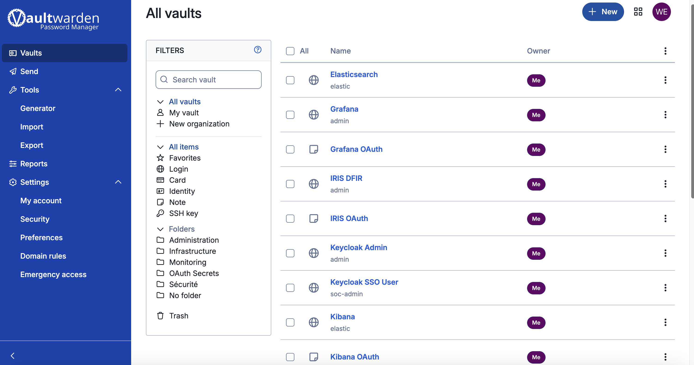

# 🛡️ SOC-in-a-Box

**Turnkey Open-Source Security Operations Center — Built from Real-World Experience**

[](https://www.nist.gov/cyberframework)
[](https://www.elastic.co/)
[](https://dfir-iris.org/)
[](https://n8n.io/)
[](https://grafana.com/)
[](https://docker.com/)
[](https://opensource.org/)
[](https://www.apple.com/macos/)

> ⚠️ **Tested on macOS** (Apple Silicon & Intel). Linux support coming soon.

---

## 📋 Overview

**SOC-in-a-Box** is a **turnkey, 100% open-source SOC platform** designed to simplify security operations deployment. Born from hands-on experience in cybersecurity, this project provides pre-configured detection rules, automated workflows, and incident response playbooks — ready to use out of the box.

### 🎯 Why SOC-in-a-Box?

- **Reduce complexity** — No more weeks of integration work
- **Pre-configured rules** — Sigma detection rules & Prometheus alerts included
- **Automation ready** — n8n workflows for alert triage, IOC enrichment, and IR
- **NIST CSF aligned** — Organized by IDENTIFY, PROTECT, DETECT, RESPOND, RECOVER
- **Team ready** — SSO with Keycloak, password management with Vaultwarden

### Key Features

| Feature | Description |
|---------|-------------|
| 🏗️ **Modular Architecture** | Enable/disable modules independently |
| 📊 **NIST Framework** | Organized by IDENTIFY, PROTECT, DETECT, RESPOND, RECOVER |
| 🔐 **SSO Ready** | Keycloak integration for unified authentication |
| 🔄 **Full Integration** | All tools interconnected via APIs and webhooks |
| 🐳 **Docker-based** | Easy deployment with Docker Compose |
| ⚙️ **Pre-configured Rules** | Detection rules and alerts ready to use |
| 🤖 **Automation First** | n8n workflows for SOAR capabilities |
| 📊 **Full Observability** | Grafana, Prometheus, Uptime Kuma |

---

## 🏗️ Architecture

```
┌─────────────────────────────────────────────────────────────────────────────┐
│                              SOC-in-a-Box                                   │
│                         NIST CSF Architecture                                │
├─────────────────────────────────────────────────────────────────────────────┤
│                                                                              │
│  ┌─────────────┐  ┌─────────────┐  ┌─────────────┐  ┌─────────────┐         │
│  │  IDENTIFY   │  │   PROTECT   │  │   DETECT    │  │   RESPOND   │         │
│  ├─────────────┤  ├─────────────┤  ├─────────────┤  ├─────────────┤         │
│  │ Asset Mgmt  │  │  Keycloak   │  │    ELK      │  │  IRIS DFIR  │         │
│  │ Vuln Audit  │  │ Vaultwarden │  │  Suricata   │  │    n8n      │         │
│  │ ZAP/Trivy   │  │     NPM     │  │    Zeek     │  │  Playbooks  │         │
│  └─────────────┘  └─────────────┘  │  Grafana    │  └─────────────┘         │
│                                    │  Prometheus │                           │
│                                    └─────────────┘                           │
│                                                                              │
│  ┌──────────────────────────────────────────────────────────────────────┐   │
│  │                        ADMINISTRATION                                 │   │
│  ├──────────────────────────────────────────────────────────────────────┤   │
│  │  Homepage │ Portainer │ Uptime Kuma │ Dozzle │ CyberChef │ Jupyter   │   │
│  └──────────────────────────────────────────────────────────────────────┘   │
│                                                                              │
└─────────────────────────────────────────────────────────────────────────────┘
```

---

## 📸 Screenshots

### Homepage Dashboard
Central dashboard to access all SOC services.


### Kibana SIEM
Log visualization, threat detection, and security analytics.


### Suricata IDS Logs
Real-time intrusion detection alerts.


### Zeek Network Analysis
Deep network traffic analysis and metadata extraction.


### IRIS DFIR
Incident response and digital forensics platform.


### n8n SOAR Workflows
Automated alert triage and response workflows.


### Keycloak SSO
Single Sign-On and identity management.


### Vaultwarden
Secure password manager for your SOC team.



### Uptime Kuma
Service availability monitoring dashboard.


### CyberChef
Data analysis and transformation toolkit.


### cAdvisor
Container resource monitoring.


---

## 🚀 Quick Start

### Prerequisites

- **macOS** (Apple Silicon or Intel) — Tested on macOS Sequoia
- **Docker Desktop** installed and running (8GB+ RAM recommended)
- **Homebrew** installed

### Installation

```bash
# 1. Clone the repository
git clone https://github.com/wezjob/soc-in-a-box.git
cd soc-in-a-box

# 2. Start core services
docker compose up -d

# 3. Start additional modules
docker compose -f modules/02-protect/administration-team/docker-compose.yml up -d
docker compose -f modules/03-detect/observability/docker-compose.yml up -d

# 4. Install native tools (Suricata, Zeek)
brew install suricata zeek
```

### First-Time Setup

```bash
# Configure Keycloak SSO
./scripts/configure-keycloak.sh

# Import credentials to Vaultwarden
./scripts/setup-vaultwarden.sh your-email@example.com your-master-password

# Configure Uptime Kuma monitors
./scripts/setup-uptime-kuma.sh admin your-password
```

---

## 📦 Services & Access

### Core Services

| Service | URL | Username | Password | Description |
|---------|-----|----------|----------|-------------|
| **Homepage** | http://localhost:3003 | - | - | Central dashboard |
| **Kibana** | http://localhost:5601 | `elastic` | `LabSoc2026!` | SIEM interface |
| **Elasticsearch** | http://localhost:9200 | `elastic` | `LabSoc2026!` | Search & storage |
| **Grafana** | http://localhost:3000 | `admin` | `GrafanaAdmin2026!` | Metrics & dashboards |

### Security & Administration

| Service | URL | Username | Password | Description |
|---------|-----|----------|----------|-------------|
| **IRIS DFIR** | https://localhost:8443 | `admin` | `d++X$mX!J6';{ONU` | Incident response |
| **Keycloak** | http://localhost:8180 | `admin` | `KeycloakAdmin2026!` | SSO / Identity |
| **Vaultwarden** | https://localhost:8085 | - | Create account | Password manager |
| **Portainer** | http://localhost:9000 | - | Create account | Docker management |

### Monitoring & Tools

| Service | URL | Username | Password | Description |
|---------|-----|----------|----------|-------------|
| **Uptime Kuma** | http://localhost:3001 | - | Create account | Availability monitoring |
| **Prometheus** | http://localhost:9090 | - | - | Metrics collection |
| **Jaeger** | http://localhost:16686 | - | - | Distributed tracing |
| **n8n** | http://localhost:5678 | - | Create account | SOAR automation |

### Analysis Tools

| Service | URL | Description |
|---------|-----|-------------|
| **CyberChef** | http://localhost:8088 | Data analysis toolkit |
| **Jupyter** | http://localhost:8888 | Threat hunting notebooks |
| **Excalidraw** | http://localhost:3002 | Architecture diagrams |
| **Draw.io** | http://localhost:8089 | Network diagrams |
| **Dozzle** | http://localhost:8087 | Real-time Docker logs |

### Deception (Honeypots)

| Service | Port | Description |
|---------|------|-------------|
| **Cowrie SSH** | 2222 | SSH honeypot |
| **Cowrie Telnet** | 2223 | Telnet honeypot |

---

## 🔐 SSO Configuration (Keycloak)

SOC-in-a-Box includes pre-configured OAuth2 clients for SSO:

| Application | Client ID | Realm |
|-------------|-----------|-------|
| Grafana | `grafana` | `soc-in-a-box` |
| Kibana | `kibana` | `soc-in-a-box` |
| n8n | `n8n` | `soc-in-a-box` |
| Portainer | `portainer` | `soc-in-a-box` |
| IRIS | `iris` | `soc-in-a-box` |

**SSO User**: `soc-admin` / `SocAdmin2026!`

Client secrets are stored in [docs/KEYCLOAK_SECRETS.md](docs/KEYCLOAK_SECRETS.md).

---

## 📂 Project Structure

```
soc-in-a-box/
├── docker-compose.yml              # Core ELK stack
├── modules/
│   ├── 01-identify/
│   │   └── vulnerability-audit/    # ZAP, Trivy
│   ├── 02-protect/
│   │   └── administration-team/    # Keycloak, Vaultwarden, NPM, Homepage
│   ├── 03-detect/
│   │   └── observability/          # Grafana, Prometheus, Alertmanager
│   ├── 04-respond/
│   │   ├── forensics/              # CyberChef, DFIR-ORC
│   │   └── threat-hunting/         # Jupyter notebooks
│   ├── 05-recover/
│   │   └── collaboration/          # Excalidraw, Draw.io
│   └── 06-red-team/
│       └── deception/              # Cowrie honeypot
├── scripts/
│   ├── configure-keycloak.sh       # Setup Keycloak realm & clients
│   ├── setup-vaultwarden.sh        # Import credentials
│   ├── setup-uptime-kuma.sh        # Configure monitors
│   ├── start.sh                    # Start all services
│   └── stop.sh                     # Stop all services
├── rules/
│   └── mitre-attack.rules          # Suricata detection rules
├── n8n/
│   └── workflows/                  # SOAR playbooks
└── docs/
    ├── CREDENTIALS.md              # All credentials reference
    ├── KEYCLOAK_SECRETS.md         # OAuth2 client secrets
    └── images/                     # Screenshots
```

---

## 🎯 MITRE ATT&CK Coverage

### Suricata Rules (50+ rules)

| Tactic | Techniques | Examples |
|--------|------------|----------|
| Initial Access | T1566, T1190 | Phishing, Exploit Public Apps |
| Execution | T1059, T1204 | Command Line, User Execution |
| Persistence | T1053, T1547 | Scheduled Tasks, Registry Run Keys |
| Defense Evasion | T1070, T1027 | Indicator Removal, Obfuscation |
| Credential Access | T1003, T1110 | Credential Dumping, Brute Force |
| Discovery | T1046, T1082 | Network Scanning, System Info |
| Lateral Movement | T1021, T1080 | Remote Services, Taint Shared Content |
| Command & Control | T1071, T1095 | Application Layer Protocol |
| Exfiltration | T1041, T1048 | Exfil Over C2, Alternative Protocol |

---

## 🔄 Integration Workflow

```
┌─────────────┐     ┌─────────────┐     ┌─────────────┐     ┌─────────────┐
│  Suricata   │────▶│  Logstash   │────▶│    ELK      │────▶│    n8n      │
│  Zeek       │     │  Processing │     │   Stack     │     │   SOAR      │
│  Auditbeat  │     │             │     │             │     │             │
└─────────────┘     └─────────────┘     └─────────────┘     └──────┬──────┘
                                                                   │
                         ┌─────────────────────────────────────────┼─────┐
                         │                                         │     │
                         ▼                                         ▼     ▼
                  ┌─────────────┐                           ┌──────────┐
                  │  IRIS DFIR  │                           │ Telegram │
                  │  Incidents  │                           │  Slack   │
                  └─────────────┘                           └──────────┘
```

---

## 🛠️ Usage

### Start All Services

```bash
# Start core infrastructure
./scripts/start.sh

# Verify services
docker ps --filter "name=labsoc"
```

### Start Network Capture

```bash
# Suricata IDS (requires sudo)
./scripts/start-suricata.sh en0

# Zeek Network Analysis (requires sudo)
./scripts/start-zeek.sh en0
```

### Generate Test Alerts

```bash
./scripts/generate-test-alerts.sh
```

---

## 🐛 Troubleshooting

### Docker containers won't start

```bash
# Check logs
docker compose logs -f

# Restart
./scripts/stop.sh && ./scripts/start.sh
```

### Suricata/Zeek not capturing

```bash
# List network interfaces
networksetup -listallhardwareports

# Use correct interface
./scripts/start-suricata.sh en0  # WiFi
./scripts/start-suricata.sh en1  # Ethernet
```

### Keycloak "HTTPS required" error

```bash
# Disable SSL for development
docker exec labsoc-keycloak bash -c '/opt/keycloak/bin/kcadm.sh config credentials \
  --server http://localhost:8080 --realm master --user admin --password KeycloakAdmin2026! && \
  /opt/keycloak/bin/kcadm.sh update realms/soc-in-a-box -s sslRequired=NONE'
```

### Vaultwarden SSL error

The web vault requires HTTPS. Access via: `https://localhost:8085` (accept self-signed certificate).

---

## 🔒 Security Notes

### Development Environment

- ⚠️ This is a **development/lab environment**
- Self-signed certificates are used for HTTPS services
- Default passwords are provided — **change them in production!**

### Production Recommendations

1. Enable TLS/HTTPS with proper certificates
2. Change all default passwords
3. Configure a reverse proxy (nginx/traefik)
4. Restrict network access
5. Enable audit logging

---

## 📜 License

MIT License - See [LICENSE](LICENSE)

## 👤 Author

- GitHub: [@wezjob](https://github.com/wezjob)

---

<p align="center">
  🛡️ <strong>SOC-in-a-Box</strong> — Your personal SOC for learning and security testing.<br>
  <em>Built with ❤️ for the cybersecurity community</em>
</p>
