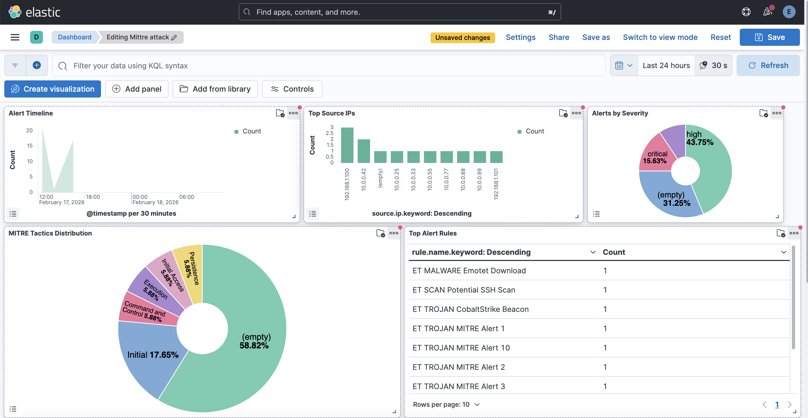
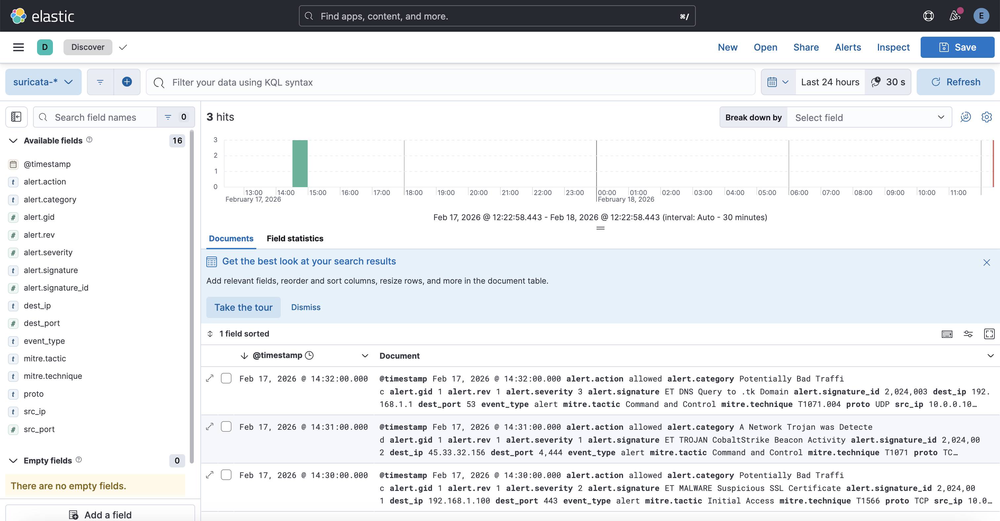
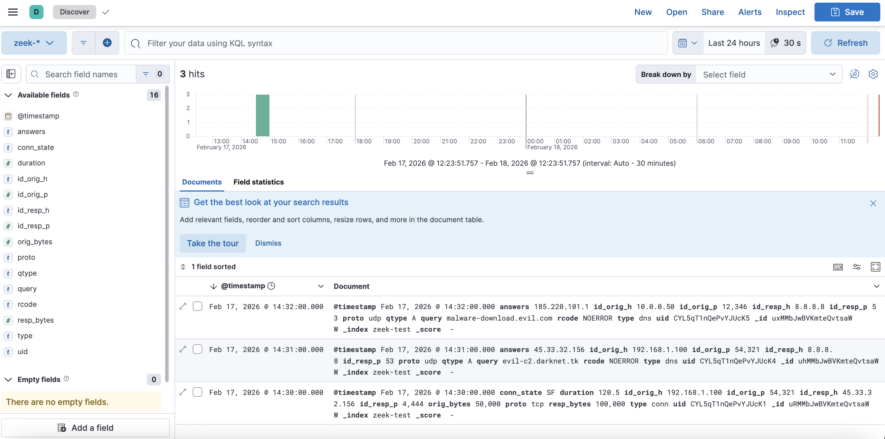
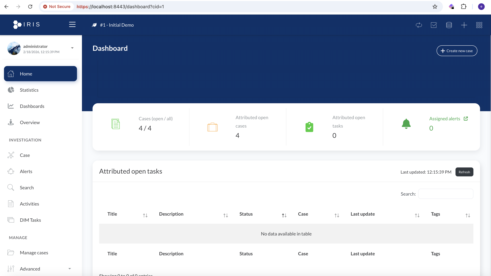
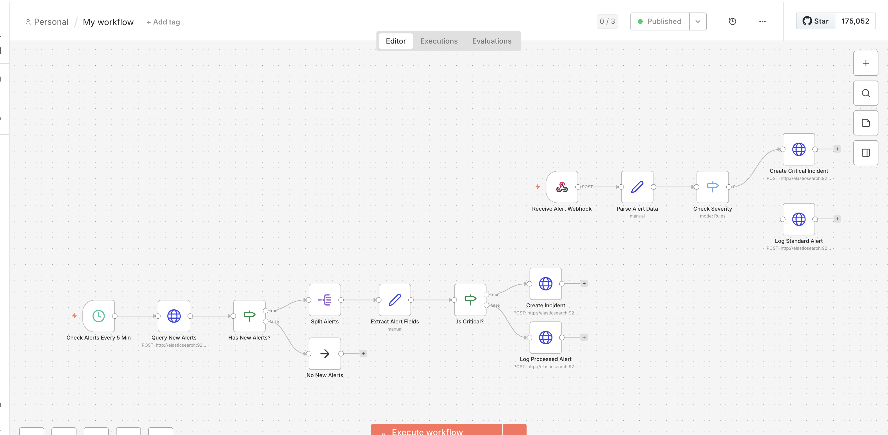
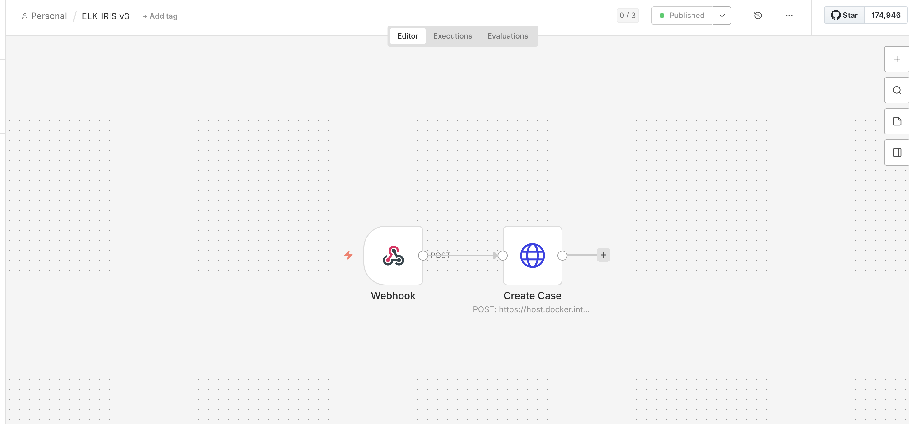

# 🛡️ SOC-in-a-Box

**Turnkey Open-Source Security Operations Center — Built from Real-World Experience**

[](https://www.nist.gov/cyberframework)
[](https://www.elastic.co/)
[](https://dfir-iris.org/)
[](https://n8n.io/)
[](https://grafana.com/)
[](https://docker.com/)
[](https://opensource.org/)

---

## 📋 Overview

**SOC-in-a-Box** is a **turnkey, 100% open-source SOC platform** designed to simplify security operations deployment. Born from hands-on experience in cybersecurity, this project provides pre-configured detection rules, automated workflows, and incident response playbooks — ready to use out of the box.

### 🎯 Why SOC-in-a-Box?

- **Reduce complexity** — No more weeks of integration work
- **Pre-configured rules** — Sigma detection rules & Prometheus alerts included
- **Automation ready** — n8n workflows for alert triage, IOC enrichment, and IR
- **NIST CSF aligned** — Organized by IDENTIFY, PROTECT, DETECT, RESPOND, RECOVER

### Key Features

- 🏗️ **Modular Architecture** — Enable/disable modules independently
- 📊 **NIST Framework** — Organized by IDENTIFY, PROTECT, DETECT, RESPOND, RECOVER
- 🔄 **Full Integration** — All tools interconnected via APIs and webhooks
- 🐳 **Docker-based** — Easy deployment with `make` commands
- ⚙️ **Pre-configured Rules** — Detection rules and alerts ready to use
- 🤖 **Automation First** — n8n workflows for SOAR capabilities

---

## 🏗️ Architecture NIST

```
┌─────────────────────────────────────────────────────────────────┐
│                        SOC-in-a-Box                             │
├─────────────────────────────────────────────────────────────────┤
│                                                                  │
│  ┌──────────┐  ┌──────────┐  ┌──────────┐                       │
│  │ Suricata │  │   Zeek   │  │Auditbeat │   (Native macOS)      │
│  │  (IDS)   │  │(Network) │  │  (HIDS)  │                       │
│  └────┬─────┘  └────┬─────┘  └────┬─────┘                       │
│       │             │             │                              │
│       └─────────────┼─────────────┘                              │
│                     ▼                                            │
│  ┌─────────────────────────────────┐                            │
│  │           Filebeat              │  (Docker)                   │
│  │        Log Collector            │                             │
│  └──────────────┬──────────────────┘                             │
│                 ▼                                                │
│  ┌─────────────────────────────────┐                            │
│  │           Logstash              │  (Docker)                   │
│  │      Pipeline Processing        │                             │
│  └──────────────┬──────────────────┘                             │
│                 ▼                                                │
│  ┌─────────────────────────────────┐                            │
│  │        Elasticsearch            │  (Docker)                   │
│  │     Search & Analytics          │                             │
│  └──────────────┬──────────────────┘                             │
│                 │                                                │
│      ┌──────────┴──────────┐                                    │
│      ▼                     ▼                                    │
│  ┌──────────┐       ┌──────────┐                                │
│  │  Kibana  │       │   n8n    │                                │
│  │  (SIEM)  │       │  (SOAR)  │                                │
│  └──────────┘       └────┬─────┘                                │
│                          │                                       │
│                          ▼                                       │
│                   ┌────────────┐                                 │
│                   │ IRIS DFIR  │  (Docker)                       │
│                   │ Incidents  │                                 │
│                   └────────────┘                                 │
│                                                                  │
└─────────────────────────────────────────────────────────────────┘
```

## � Captures d'écran

### Dashboard Kibana


### Logs Suricata (IDS)


### Logs Zeek (Network Analysis)


### IRIS DFIR - Gestion d'incidents


### Workflow n8n - Alertes Automatisées


### Workflow n8n - Intégration IRIS


---

## �🚀 Installation

### Prérequis

- macOS (Apple Silicon ou Intel)
- Docker Desktop installé et en cours d'exécution
- Homebrew installé
- 8GB RAM minimum recommandé

### Installation rapide

```bash
# 1. Cloner le repo
git clone https://github.com/wezjob/labsoc-home.git
cd labsoc-home

# 2. Démarrer les containers Docker
./scripts/start.sh

# 3. Installer Suricata et Zeek (natifs)
brew install suricata zeek

# 4. Installer Auditbeat (HIDS)
./scripts/install-auditbeat.sh
```

## 📦 Services

| Service | Port | Description |
|---------|------|-------------|
| Elasticsearch | 9200 | Moteur de recherche et stockage |
| Kibana | 5601 | Interface de visualisation |
| Logstash | 5044, 5514 | Traitement des logs |
| n8n | 5678 | Automatisation SOAR |
| IRIS DFIR | 8443 | Gestion d'incidents (HTTPS) |
| Redis | 6379 | Cache |
| PostgreSQL | 5432 | Base de données n8n |

## 🔐 Identifiants par défaut

| Service | Utilisateur | Mot de passe |
|---------|-------------|--------------|
| Elasticsearch | elastic | LabSoc2026! |
| Kibana | elastic | LabSoc2026! |
| IRIS DFIR | administrator | (voir .env dans iris-web/) |
| n8n | admin | LabSocN8N2026! |
| PostgreSQL | labsoc | LabSocDB2026! |

> ⚠️ **Important** : Changez ces mots de passe en production !

---

## 🔬 IRIS DFIR - Gestion d'Incidents

### Installation

```bash
# Cloner IRIS dans le projet
cd labsoc-home
git clone https://github.com/dfir-iris/iris-web.git

# Configuration
cd iris-web
cp .env.model .env
# Éditer .env avec vos paramètres

# Démarrer IRIS
docker compose up -d
```

### Accès

- **URL** : https://localhost:8443
- **User** : `administrator`
- **Password** : Généré au premier démarrage (voir `docker logs iris-web`)

### Obtenir la clé API IRIS

1. Se connecter à IRIS : https://localhost:8443
2. Menu → **My Settings** → **API Key**
3. Cliquer **Reveal API Key**
4. Copier la clé pour l'utiliser dans n8n

---

## 🔗 Intégration ELK → n8n → IRIS

### Architecture

```
┌──────────────────────────────────────────────────────────────────┐
│                    LabSOC Integration Flow                        │
├──────────────────────────────────────────────────────────────────┤
│                                                                   │
│   ┌─────────┐    ┌─────────┐    ┌─────────┐    ┌─────────┐       │
│   │Suricata │    │Logstash │    │  ELK    │    │  n8n    │       │
│   │  Zeek   │───▶│         │───▶│ Stack   │───▶│  SOAR   │       │
│   │Auditbeat│    │         │    │         │    │         │       │
│   └─────────┘    └─────────┘    └─────────┘    └────┬────┘       │
│                                                      │            │
│                                                      ▼            │
│                                               ┌─────────┐         │
│                                               │  IRIS   │         │
│                                               │  DFIR   │         │
│                                               └─────────┘         │
│                                                                   │
└──────────────────────────────────────────────────────────────────┘
```

### Configuration du Workflow n8n

1. **Ouvrir n8n** : http://localhost:5678

2. **Importer le workflow** :
   - Menu → Import from file
   - Sélectionner : `n8n/workflows/elk-iris-v3.json`

3. **Configurer le credential IRIS** :
   - Cliquer sur le node "Create Case"
   - Credential → Create New → Header Auth
   - **Name** : `Authorization`
   - **Value** : `Bearer VOTRE_CLE_API_IRIS`

4. **Activer le workflow** :
   - Toggle en haut à droite → **Active**

5. **Webhook** : `http://localhost:5678/webhook/elk-iris-v3`

### Tester l'intégration

```bash
# Envoyer une alerte de test
curl -X POST 'http://localhost:5678/webhook/elk-iris-v3' \
  -H 'Content-Type: application/json' \
  -d '{
    "severity": "critical",
    "rule_name": "ET TROJAN Test Alert",
    "src_ip": "192.168.1.100",
    "dest_ip": "185.220.101.50",
    "mitre": {
      "technique": "T1071.001",
      "tactic": "Command and Control"
    }
  }'

# Vérifier dans IRIS (API)
curl -sk 'https://localhost:8443/manage/cases/list' \
  -H "Authorization: Bearer VOTRE_CLE_API"
```

---

## 📊 Configuration Kibana - Visualisations

### 1. Créer les Data Views

```bash
# Via API (automatique)
./scripts/create-visualizations.sh

# Ou manuellement dans Kibana :
# Menu → Stack Management → Data Views → Create
# Patterns : suricata-*, zeek-*, labsoc-*
# Time field : @timestamp
```

### 2. Champs disponibles pour visualisations

| Visualisation | Champ |
|---------------|-------|
| Severity | `event.severity.keyword` |
| Source IP | `source.ip.keyword` |
| Dest IP | `destination.ip.keyword` |
| Rule Name | `rule.name.keyword` |
| MITRE Tactic | `mitre.tactic.keyword` |
| MITRE Technique | `mitre.technique.keyword` |
| Timeline | `@timestamp` |

### 3. Créer les visualisations

Dans Kibana → **Visualize Library** → **Create visualization** :

#### Total Alerts (Metric)
- Type : **Metric**
- Data View : `labsoc-*`
- Metric : Count of records

#### Alerts by Severity (Donut)
- Type : **Pie/Donut**
- Slice by : `event.severity.keyword` (Top 5)
- Metric : Count

#### MITRE Tactics Distribution (Pie)
- Type : **Pie**
- Slice by : `mitre.tactic.keyword` (Top 10)
- Metric : Count

#### Top Source IPs (Bar)
- Type : **Bar horizontal**
- X-axis : `source.ip.keyword` (Top 10)
- Y-axis : Count

#### Alert Timeline (Area)
- Type : **Area**
- X-axis : `@timestamp` (Date histogram)
- Y-axis : Count

#### Top Alert Rules (Table)
- Type : **Table**
- Split rows : `rule.name.keyword` (Top 10)
- Metric : Count

### 4. Créer le Dashboard

1. Menu → **Dashboard** → **Create dashboard**
2. Cliquer **Add from library**
3. Sélectionner les 6 visualisations
4. Arranger et redimensionner
5. **Save** → Nom : `LabSOC Security Dashboard`

---

## 🎯 Règles MITRE ATT&CK

### Suricata (50+ règles)

Le fichier `rules/mitre-attack.rules` contient des règles mappées aux tactiques MITRE :

| Tactique | Techniques | Exemples |
|----------|------------|----------|
| Initial Access | T1566, T1190 | Phishing, Exploit Public Apps |
| Execution | T1059, T1204 | Command Line, User Execution |
| Persistence | T1053, T1547 | Scheduled Tasks, Registry Run Keys |
| Privilege Escalation | T1055, T1068 | Process Injection, Exploitation |
| Defense Evasion | T1070, T1027 | Indicator Removal, Obfuscation |
| Credential Access | T1003, T1110 | Credential Dumping, Brute Force |
| Discovery | T1046, T1082 | Network Scanning, System Info |
| Lateral Movement | T1021, T1080 | Remote Services, Taint Shared Content |
| Collection | T1005, T1114 | Data from Local System, Email |
| Command and Control | T1071, T1095 | Application Layer Protocol |
| Exfiltration | T1041, T1048 | Exfil Over C2, Alternative Protocol |

### Elasticsearch (10 règles de détection)

```bash
# Charger les règles via API
./scripts/load-mitre-rules.sh

# Ou importer manuellement
curl -u elastic:LabSoc2026! -X POST \
  "http://localhost:5601/api/detection_engine/rules/_bulk_create" \
  -H "kbn-xsrf: true" -H "Content-Type: application/json" \
  -d @rules/elasticsearch-mitre-rules.json
```

## 📂 Structure du projet

```
labsoc-home/
├── docker-compose.yml          # Configuration Docker
├── .env                        # Variables d'environnement
├── elasticsearch/
│   └── config/elasticsearch.yml
├── kibana/
│   ├── config/kibana.yml
│   └── dashboards/             # Dashboards exportés
├── logstash/
│   └── config/
│       ├── logstash.yml
│       ├── pipelines.yml
│       └── pipeline/           # Configurations pipeline
│           ├── main.conf       # Beats (Filebeat, Auditbeat)
│           ├── suricata.conf   # Logs Suricata
│           ├── zeek.conf       # Logs Zeek
│           └── syslog.conf     # Syslog
├── filebeat/
│   └── config/filebeat.yml
├── auditbeat/
│   └── config/auditbeat.yml    # HIDS configuration
├── suricata/
│   └── config/suricata.yaml
├── zeek/
│   └── config/
│       ├── local.zeek
│       ├── node.cfg
│       └── networks.cfg
├── rules/
│   └── local.rules             # Règles Suricata personnalisées
├── n8n/
│   ├── workflows/              # Workflows SOAR
│   └── data/                   # Données n8n
├── scripts/
│   ├── start.sh                # Démarrer tous les services
│   ├── stop.sh                 # Arrêter les services
│   ├── start-suricata.sh       # Démarrer Suricata (natif)
│   ├── start-zeek.sh           # Démarrer Zeek (natif)
│   ├── start-auditbeat.sh      # Démarrer Auditbeat (HIDS)
│   ├── generate-test-alerts.sh # Générer alertes de test
│   ├── setup-alerting.sh       # Configurer les alertes
│   └── backup.sh               # Sauvegarde
└── logs/                       # Logs locaux
```

## 🎯 Utilisation

### Démarrer l'infrastructure

```bash
# Démarrer Docker containers
./scripts/start.sh

# Vérifier les services
docker ps --filter "name=labsoc"
```

### Démarrer la capture réseau

```bash
# Suricata (IDS) - nécessite sudo
./scripts/start-suricata.sh en0

# Zeek (Network Analysis) - nécessite sudo
./scripts/start-zeek.sh en0

# Auditbeat (HIDS) - nécessite sudo
./scripts/start-auditbeat.sh
```

### Accéder aux interfaces

- **Kibana** : http://localhost:5601 (elastic/LabSoc2026!)
- **n8n** : http://localhost:5678 (admin/LabSocN8N2026!)
- **Elasticsearch** : http://localhost:9200

### Générer des alertes de test

```bash
./scripts/generate-test-alerts.sh
```

## 🔍 Intégration n8n ↔ ELK

### Configuration n8n

1. Ouvrir http://localhost:5678
2. Créer un credential HTTP Basic Auth :
   - Nom : `Elasticsearch`
   - User : `elastic`
   - Password : `LabSoc2026!`
3. Importer les workflows depuis `n8n/workflows/`

### Workflows disponibles

| Workflow | Description |
|----------|-------------|
| `alert-monitor-elk.json` | Poll Elasticsearch toutes les 5 min pour nouvelles alertes |
| `webhook-alert-receiver.json` | Reçoit des alertes via webhook |

### Architecture d'automatisation

```
┌─────────────┐     ┌─────────────┐     ┌─────────────┐
│ Suricata/   │────▶│ Elasticsearch│────▶│    n8n     │
│ Zeek/Audit  │     │   (index)   │     │  (polling) │
└─────────────┘     └─────────────┘     └─────────────┘
                                               │
                    ┌──────────────────────────┼──────────────┐
                    │                          │              │
                    ▼                          ▼              ▼
             ┌──────────┐              ┌──────────┐    ┌──────────┐
             │ Escalate │              │   Log    │    │ Respond  │
             │ Incident │              │ Processed│    │  Action  │
             └──────────┘              └──────────┘    └──────────┘
```

## 📊 Dashboards Kibana

### Créer le Data View

1. Menu ☰ → Stack Management → Data Views
2. Create data view : `labsoc-*`
3. Time field : `@timestamp`

### Visualisations recommandées

- **Total Events** : Metric count
- **Events by Source** : Pie chart par `labsoc.source`
- **Events by Severity** : Bar chart par `event.severity`
- **Timeline** : Line chart avec `@timestamp`
- **Top Source IPs** : Table avec `source.ip`

## 🛠️ Règles de détection Suricata

Le fichier `rules/local.rules` contient 15 règles personnalisées :

| SID | Description |
|-----|-------------|
| 1000001 | SSH Brute Force |
| 1000002 | DNS Tunneling |
| 1000003 | Large File Exfiltration |
| 1000004-5 | Suspicious Ports (4444, 1337) |
| 1000006 | TOR Network |
| 1000007 | Crypto Mining |
| 1000008 | ICMP Tunnel |
| 1000009 | C2 Beaconing |
| 1000010 | Lateral Movement (SMB) |
| 1000011 | Ransomware Activity |
| 1000012-13 | Phishing Domains |
| 1000014 | PowerShell Download |
| 1000015 | SQL Injection |

## 🔒 Sécurité

### Authentification

- ✅ Elasticsearch xpack.security activé
- ✅ Authentification requise pour tous les services
- ✅ Mots de passe complexes par défaut

### Réseau

- ⚠️ HTTP uniquement (pas de TLS) - environnement de dev
- Services sur réseau Docker isolé
- Ports exposés uniquement sur localhost

### Recommandations production

1. Activer TLS/HTTPS
2. Changer tous les mots de passe par défaut
3. Configurer un reverse proxy (nginx/traefik)
4. Limiter les accès réseau

## 📝 Logs

Les logs sont stockés dans :

- **Suricata** : `/opt/homebrew/var/log/suricata/`
- **Zeek** : `/opt/homebrew/var/log/zeek/current/`
- **Auditbeat** : `/opt/homebrew/var/log/auditbeat/`

## 🐛 Dépannage

### Docker containers ne démarrent pas

```bash
# Vérifier les logs
docker compose logs -f

# Redémarrer
./scripts/stop.sh && ./scripts/start.sh
```

### Suricata/Zeek ne capturent pas

```bash
# Vérifier l'interface réseau
networksetup -listallhardwareports

# Utiliser la bonne interface
./scripts/start-suricata.sh en0  # WiFi
./scripts/start-suricata.sh en1  # Ethernet
```

### Elasticsearch health rouge

```bash
# Vérifier l'état
curl -u elastic:LabSoc2026! http://localhost:9200/_cluster/health?pretty

# Augmenter la mémoire si nécessaire
# Modifier ES_JAVA_OPTS dans docker-compose.yml
```

## 📜 Licence

MIT License - Voir [LICENSE](LICENSE)

## 👤 Auteur

- GitHub: [@wezjob](https://github.com/wezjob)

---

🛡️ **LabSOC Home** - Votre SOC personnel pour l'apprentissage et les tests de sécurité.
